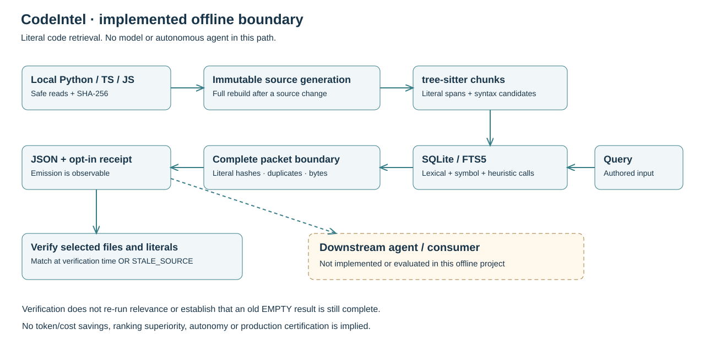
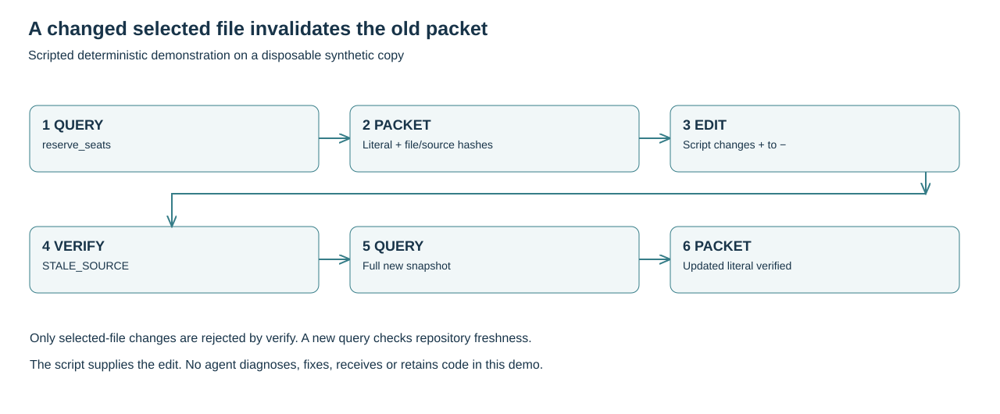

# Design: the boundary before context consumption

## Deliberately reused components

The [lab adapter](../../codeintel/lab/retrieval.py) calls the existing [index service](../../codeintel/service/domain_service.py), [parser](../../codeintel/parsing/) and [retrieval layer](../../codeintel/retrieval/). It does not introduce another indexing engine. Dense providers, SCIP, hooks and agent orchestration are removed from the maintained runtime. It uses no model or remote-provider dependency. Changes cause a full rebuild; dependency-aware incremental relation reuse was not validated.

## Contracts

- **Agent boundary:** output is prepared or emitted; no downstream agent receipt, retention, autonomy or performance is verified.
- **Privacy:** packets contain exact source and do not auto-redact secrets. Keep them as private as the inspected repository. The demo uses only synthetic source.
- **Source:** relative paths, source/file SHA-256 and literal tree-sitter spans. Lines start at 1; columns are UTF-8 bytes; the end is exclusive. Scores are ranking signals, not probabilities of correctness.
- **Budget:** 4,096 bytes by default, configurable from 1,024 to 8,192. The complete serialized JSON plus final newline must fit, including metadata. Up to 32 retrieved candidates reach packet selection; retrieval itself may inspect more indexed chunks; 5 fragments are emitted by default, configurable up to 20. Whole fragments are omitted if necessary.
- **Aliases and coverage:** packet v2 stores equal text once and retains independently verified source locations. It reports literal coverage of the known syntax range, attempts to expand exact symbols (including children) only when the provisional complete JSON plus a conservative 64-byte reserve fits, and directs partial readers to the recorded range or full file. Dependencies are not promised. Candidate-limited aliases are not exhaustive. v1 verification remains supported.
- **Empty/bounded output:** `EMPTY` and `BUDGET_EXHAUSTED` are explicit outcomes. Neither is a relevance success. Deduplication is exact full-fragment equality inside one packet, not cross-turn memory or partial-overlap removal.
- **Freshness:** changed, deleted or added files invalidate the indexed generation. Verification checks selected files/literals; it does not compare the entire snapshot or authenticate its declared digest. A change to a selected file fails verification, even if its selected literal is unchanged. It does not re-run relevance or prove that an `EMPTY` result remains complete after a repository change. Verification is a point-in-time check, not an authentication service or a guarantee against later changes.
- **State and failure:** state outside source; symlinks rejected at the state boundary; malformed nested packet schemas rejected; expected source-decoding/storage errors have structured recovery. Unexpected programmer errors remain visible.
- **Observation:** optional receipts record configuration, hashes, counts and duration without query/source text. Emission to stdout is not proof of an agent's receipt, retention or rereads. Bytes are not tokens.

## Explicit syntax and state boundaries

Generation-local FTS5 corpora keep retired generations from changing the active generation's BM25 statistics. For unscoped multi-repository queries, active corpora are round-robined rather than treating their BM25 values as directly comparable. DB schema v1 is rejected by schema v2; preserve old state and use a fresh state directory instead of an implicit migration.

The parser recognizes typed JS/TS variable arrows with expression or block bodies. Nested JS/TS declarations and interface method signatures can remain literal text without a separately indexed entity. Python lambda defaults belong to the enclosing eager-call context; deferred bodies do not. These syntax rules do not resolve dynamic behavior or promise every dependency.

Typed receiver evidence is dropped after wrapped assignments and when a local generic parameter shadows a concrete class name. Nested abstract-class bodies do not borrow the enclosing function's call owner. This syntax-policy change invalidates v5 generations and rebuilds them even when source bytes are unchanged; it does not add compiler or runtime binding proof.

The CLI reports expected source failures as structured stderr with exit 2: SOURCE_INVALID_UTF8, SOURCE_TOO_LARGE, SOURCE_UNAVAILABLE and SOURCE_ENUMERATION_FAILED. The unavailable category includes non-UTF-8 source path spellings. Index/query require a UTF-8 repository identity and state path; invalid effective root paths fail before state creation, with `SOURCE_UNAVAILABLE` or `INVALID_STATE_PATH`. Non-UTF-8 query arguments are rejected as `INVALID_QUERY` before opening index state. Malformed persisted row types, spans, enum labels or JSON shapes fail closed with `DerivedStateValidationError`; preserve the rejected state and choose a fresh external state directory. Unexpected programming exceptions remain visible. Verification still checks selected locations at a point in time; it is not an atomic snapshot of the reader's whole filesystem.

## Implementation map

| Concern | Entry point |
|---|---|
| CLI and structured errors | [lab/cli.py](../../codeintel/lab/cli.py) |
| Query/index/verification boundary | [lab/retrieval.py](../../codeintel/lab/retrieval.py) |
| Fixed synthetic experiment | [lab/scenarios.py](../../codeintel/lab/scenarios.py) |
| Narrated view of actual reports | [lab/presentation.py](../../codeintel/lab/presentation.py) |
| Regression cases | [test_portfolio_lab.py](../../tests/test_portfolio_lab.py) |
| Presentation/JSON compatibility | [test_portfolio_presentation.py](../../tests/test_portfolio_presentation.py) |

The text view only renders the same report; machine-readable JSON remains the default. Query packets are unchanged, so their byte-budget and verification contracts do not depend on presentation.

## Compatibility and resource boundaries

The CLI is the maintained product interface. Retained low-level compatibility
helpers, parser-dispatch alias, enum values, SQLite inspection/ABC methods,
legacy-vector cleanup and SCIP argument validation do not ship a graph SDK,
vector engine or SCIP runner. Unscoped graph APIs are outside the CLI contract.
Direct low-level database writes do not carry the index service's immutable-
generation guarantee; use the service lifecycle for that boundary.

The scanner limits candidate files and directories to 100,000 each. Maintained
SQLite retrieval admits at most 128 exact-entity rows, 16 qualified variants,
and 4,096 entity chunk bodies / 8 MiB of their UTF-8 contents per acquisition
budget. These caps can omit existing matches. The literal baseline streams the
complete admitted chunk corpus while retaining its first 32 matches in
path/span order; it is not a 32-row total scan.

The packet, candidate, source-reader and subprocess owners have named resource
bounds. These are not a whole-command deadline, global memory bound, or an OS
sandbox. Short-query scan byte limits do not bound SQLite metadata work or
physical I/O. Validation has separate finite stage/suite deadlines. No latency,
scaling or incremental-rebuild speedup is promised.

POSIX no-follow directory/process behavior is validated on Linux x86_64 with
CPython 3.12 and the checked-in pins. There is no current Windows/macOS acceptance
claim. Schema v1 is rejected; preserve old state and use a fresh state directory.
Compatibility fixtures intentionally exercise older persisted states and are
not disposable historical receipts.
